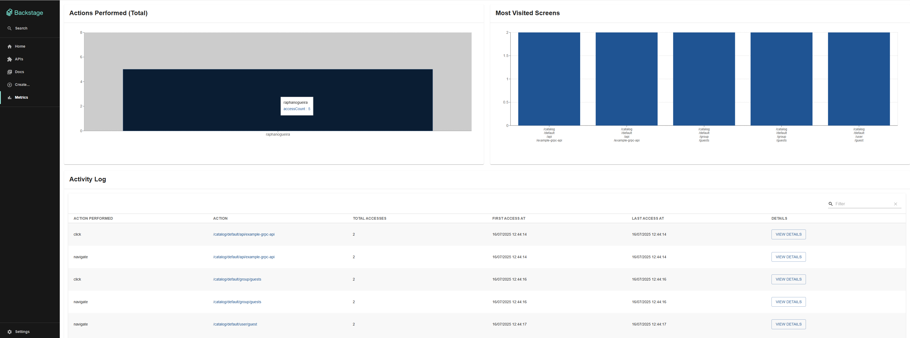
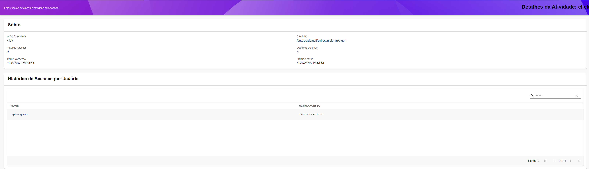

# Analytics Internal plugin for Backstage

This is the Analytics Internal plugin for Backstage.io.

This plugin provides insights into user activity within your Backstage.io instance, natively and without the need for external analytics tools. It also offers the flexibility to forward these events to other platforms if required.

You can obtain the following information:
 - Screen views
 - Actions performed by users
 - Access counts per item
 - Timestamps for the first and last access
 - A detailed view for each item, allowing you to identify which users have accessed it.

# Analytics Internal Backend

For installation instructions and more details on how this package works, [please refer to the backend's README](./backend/README.md).

**Important Note**: This package operates independently and is decoupled from other analytics packages.

# Analytics Internal Frontend

For installation instructions and more details on how this package works, [please refer to the frontend's README](./frontend/README.md).

**Important Note**: This package is tightly coupled with the `plugin-analytics-internal-backend` package and depends on it to function.

# Analytics Internal Module

For installation instructions and more details on how this package works, [please refer to the module's README](./module/README.md).

**Important Note**: This package is tightly coupled with the `plugin-analytics-internal-backend`. Misconfiguration can lead to errors, as it is designed to consume data from the backend plugin.