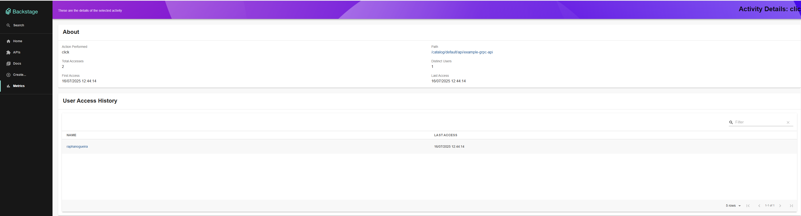

# Analytics Internal plugin for Backstage

This is the Analytics Internal plugin for Backstage.io

Esse plugin serve para ter uma visão do que está sendo acessado pelos seus usuários dentro do backstage.io sem precisar se comunicar com alguma ferramenta externa. Mas também possibilitando caso queira enviar eventos para alguma plataforma.

Você pode obter as seguinte informações:
 - Telas acessadas
 - Ações executadas
 - Número de acessos
 - Quando foi feito o primeiro e último acesso.
 - Visão de detalhe dos elementos na listagem, podendo visualizar quem foram as pessoas que acessaram esse caminho.

# Analytics Internal Backend

Para instalar o pacote backend e ter mais infomações sobre o funcionamento do plugin basta clicar em [Saiba mais](./backend/README.md)

**Ponto de Atenção**: Não possui acoplamento com os outros pacotes ele funciona por conta propria.

# Analytics Internal Frontend

Para instalar o pacote frontend e ter mais informações sobre o funcionamendo do plugin basta clicar em [Saiba mais](./frontend/README.md)

**Ponto de Atenção**: Possui um alto acoplamento com o pacote [plugin-analytics-internal-backend](#analytics-internal-backend)

# Analytics Internal Module

Para intalar o pacote de modulo e ter mais informações sobre o funcionamento do plugin basta clicar em [Saiba mais](./module/README.md)

**Ponto de Atenção**: Possui um alto acoplamento com o pacote [plugin-analytics-internal-backend](#analytics-internal-backend) podendo gerar possiveis erros caso o plugin não seja configurado da maneira correta para não consumir do [plugin-analytics-internal-backend](#analytics-internal-backend)